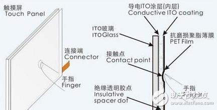

# 第二章 多媒体个人计算机

## 多媒体关键技术

- 数据压缩技术
- 集成电路制作技术
- 存储技术

## MPC

- MPC是Multimedia Personal Computer的缩写，意思是多媒体个人计算机。
- MPC不仅含有“多媒体个人计算机”之意，而且还代表MPC的工业标准。
- 因此，严格地说，多媒体个人计算机是指符合MPC标准的，具有多媒体功能的个人计算机。

## CD-ROM激光存储器原理

- CD-ROM是只读光盘存储器。
- CD-ROM的片基采用聚碳酸酯塑料制成。这种材料强度高，耐冲击，不易龟裂变形。在塑料表面采用特殊工艺附着一层铝反射层，用于记录数据。光盘的结构如下：

](imgs/cd-rom.jpg)
- CD-ROM采用光学存储原理。激光束照射到光盘铝反射层的微小区域，使局部烧出凹坑，有无凹坑代表了二进制信息的两种状态，从而把数据记录在光盘上。

## 触摸屏，视频卡，扫描仪

### 触摸屏

- 红外线触摸屏

    红外线触摸屏是一种利用红外线技术的装置，其传感器的外框是一个边框，边框四周布满红外线发射器和接收器，形成纵横交错的红外线矩阵。将传感器固定在普通显示器前面，当手触摸显示器的屏幕时，红外线被遮挡，检测X方向和Y方向被遮挡的红外线位置，就可以得到被触摸位置的坐标数据。
- 电容触摸屏

    电容触摸屏利用电容量的改变进行检测。当人体触摸该屏幕时，与触摸屏相连的震荡回路中的电容量发生改变，从而会破坏震荡的条件，这种变化被触摸屏控制电路检测并转换成触摸信号好坐标数据。
    
    电容触摸屏的结构如下：
    
    
- 电阻触摸屏

    电阻触摸屏是一种具有一定电阻的薄膜，薄膜呈透明状态，使用时，将其贴在显示器的正面。
    
    电阻触摸屏采用多层符合结构，由玻璃或者有机玻璃作为基膜，在基膜上涂覆两层ITO透明导电层，导电层之间留有缝隙（小于1/1000in），互相绝缘。在最外面，涂覆透明光滑，且耐磨损的塑料保护层。
    
    当手触摸电阻触摸屏时，靠近外表面的ITO透明导电层由于受压而发生凹陷，与下面的ITO透明导电层接触，接通电路。由于ITO透明导电层有一定的电阻，该接触点与ITO透明导电层边缘的距离与电阻值有一定的比例关系，因此，通过计算x方向和y方向的电阻值，就可知道触摸位置的坐标数值。
- 表面声波触摸屏
- 矢量压力触摸屏

### 视频卡

- 视频卡的四个基本特性：
    
    1. 视频输入特性。支持PAL制式（我们国家采用的），NTSC制式和SECAM制式的视频信号模式，利用驱动软件的功能，可以选择视频输入的端口。
    2. 图形与视频混合特性。
    3. 图像采集特性。
    4. 画面处理特性。
- 视频卡的种类以及功能,按照功能划分有：
    
    1. 视频转换卡，将计算机的VGA显示信号转换成视频信号，输出到电视机，录像机等视频设备中。
    - 视频捕捉卡，将视频信号源的信号转换成静态的数字图像信号，进而对其进行加工和修改，并保存为标准格式的图像文件。
    - 动态视频捕捉卡。
    - 视频压缩卡。
    - 视频合成卡。
- 选择视频卡的注意事项：

    1. 输入输出信号模式。为了追求较高的图像品质，一般采用NTSC制式，并要求使用S信号端子。
    - 画面分辨率。
    - 颜色模式。
    - 图像文件格式

- 视频卡的结构原理

    略

### 扫描仪

- 扫描仪是一种图形输入设备，由光源，光学镜头，光敏元件，机械移动部件和电子逻辑部件组成。
- 连接方式

    - USB
    - SCSI
- 种类

    - 按照基本构造分类
    
        - 手持式扫描仪
        - 立式胶片扫描仪
        - 平板式扫描仪
        - 台式扫描仪
        - 滚筒式扫描仪
        - 多功能扫描仪
    - 按照扫描原理分类
    
        - 反射式扫描
        - 透射式扫描
        - 混合式扫描
- 基本工作原理

    - 反射式扫描
    
        在平板扫描仪的内部，有一个由步进电动机驱动的可移动拖架，拖架上有光源，反射镜片，透镜和CCD光点转换元件等。扫描时，原稿固定不动，拖架移动，其上的光源随拖架移动，光线照射到正面向下的原稿上，其过程类似复印机。图片反射回来的光线通过反射镜反射到透镜上，经过透镜的聚焦，投影到CCD光电转换元件上，经过光电转换形成电信号，然后进行译码，将数字信号输出。
    - 透射式扫描
    
        - 专用胶片扫描仪
            
            反射镜片，透镜，CCD光电转换元件和光源安装在固定架上，不能移动，可移动的是胶片原稿。
            
            扫描时，固定在移动架上的胶片原稿缓慢移动，光源的光线透过胶片照射到反射镜片上，经过反射，聚焦，由CCD光电转换元件转换成电信号，最后经译码传送到主机中。
        - 混合式扫描仪
        
            在扫描时，胶片原稿固定不动，移动拖架在步进电动机的带动下移动，顶部的独立光源也同步地随之移动，该光源的光线穿透胶片照射到移动拖架上的反射镜片，透镜的CCD光电转换元件上，变成电信号。最后经过译码，把数字化图像送到主机中。
- 扫描仪的技术指标

    1. 扫描分辨率
    2. 色彩精度
    3. 扫描速度
    4. 内置图像处理能力
    5. 智能去网
    6. VAROS光学分辨率倍增性能